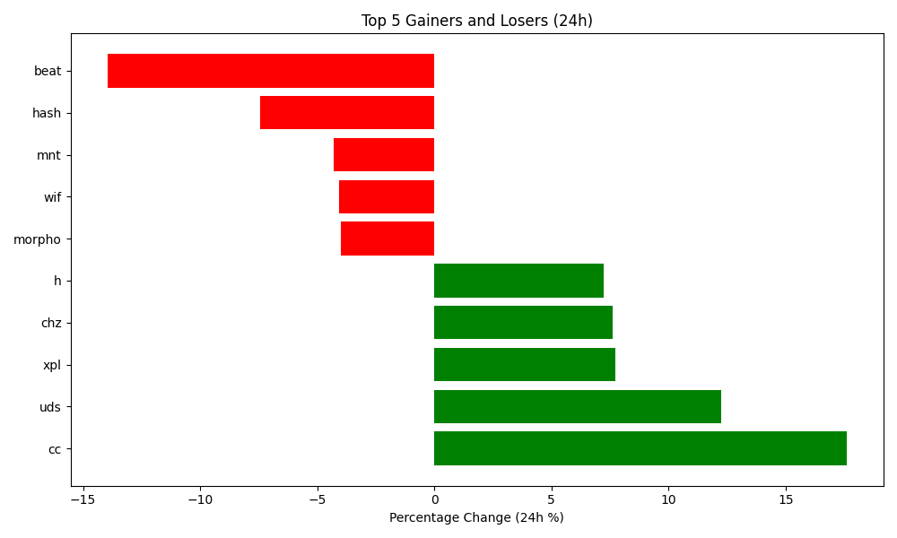

# Crypto Tracker (24h)
Author: Hitesh Agrawal

This repository automatically tracks the top 5 gaining, top 5 losing, and top 5 highest volume cryptocurrencies in the last 24 hours using the CoinGecko API, Python, Matplotlib, and GitHub Actions updates the below content everyday at midnight.

<!-- START_DYNAMIC_CONTENT -->
Last updated: 2025-12-30 01:09 UTC



**🚀 Top 5 Gainers (24h)**

| Rank | Coin | Price Change (24h %) | Volume (USD) | Current Price (USD) |
| :--: | :--: | :------------------: | :----------: | :-----------------: |
| 1 | night | 7.36% | $113,102,319 | $0.0969 |
| 2 | qrl | 5.06% | $216,939 | $2.8900 |
| 3 | h | 3.49% | $53,458,696 | $0.1695 |
| 4 | vsn | 3.41% | $34,691,024 | $0.0824 |
| 5 | stable | 3.01% | $34,199,647 | $0.0134 |


**👇 Top 5 Losers (24h)**

| Rank | Coin | Price Change (24h %) | Volume (USD) | Current Price (USD) |
| :--: | :--: | :------------------: | :----------: | :-----------------: |
| 1 | merl | -13.33% | $31,688,335 | $0.3031 |
| 2 | borg | -9.90% | $876,147 | $0.2488 |
| 3 | cc | -9.30% | $36,832,525 | $0.1263 |
| 4 | wif | -8.30% | $135,435,448 | $0.2893 |
| 5 | fartcoin | -7.70% | $82,786,484 | $0.2831 |


**💎 Top 5 by Trade Volume (24h)**

| Rank | Coin | Price Change (24h %) | Volume (USD) | Current Price (USD) |
| :--: | :--: | :------------------: | :----------: | :-----------------: |
| 1 | usdt | -0.03% | $86,427,667,509 | $0.9989 |
| 2 | btc | -1.02% | $52,673,966,068 | $87,086.0000 |
| 3 | eth | -0.85% | $27,116,834,204 | $2,930.9200 |
| 4 | usdc | -0.02% | $13,355,231,648 | $0.9997 |
| 5 | sol | -2.98% | $4,735,279,463 | $122.8100 |


<!-- END_DYNAMIC_CONTENT -->

## How to generate the coingecko demo public api key

[coingecko-api-key-docs](https://support.coingecko.com/hc/en-us/articles/21880397454233-User-Guide-How-to-sign-up-for-CoinGecko-Demo-API-and-generate-an-API-key)

## Requirements to setup
## 1. Install uv

```bash
brew install uv
✔︎ JSON API cask.jws.json                                                                                                                                                       [Downloaded   15.1MB/ 15.1MB]
✔︎ JSON API formula.jws.json                                                                                                                                                    [Downloaded   32.1MB/ 32.1MB]
# or Linux
curl -LsSf https://astral.sh/uv/install.sh | sh
```

---

## 2. Setup Python Environment (uv)

From the project root:

```bash
uv python install 3.12
uv venv --python 3.12
source .venv/bin/activate
```

Install dependencies (locked):
```bash
uv add pandas requests matplotlib python-dotenv
```


---

## 4. Update coingecko demo key in .env ( I have provided in .env.sample)
```bash
cat .env
CGK_API_DEMO_KEY="Your-coingecko-demo-api-key-here"
```

---

## 3. To manually run the script
```bash
python3.12 main.py
```
---
