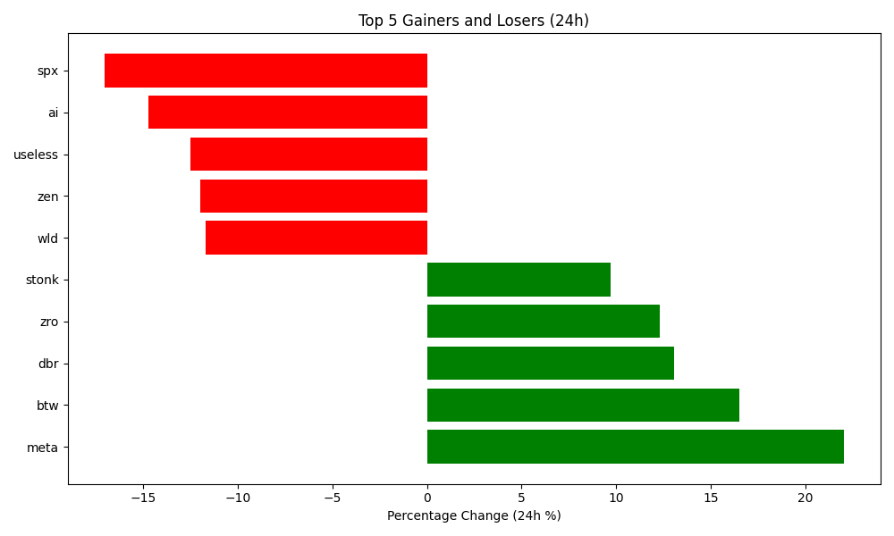

# Crypto Tracker (24h)
Author: Hitesh Agrawal

This repository automatically tracks the top 5 gaining, top 5 losing, and top 5 highest volume cryptocurrencies in the last 24 hours using the CoinGecko API, Python, Matplotlib, and GitHub Actions updates the below content everyday at midnight.

<!-- START_DYNAMIC_CONTENT -->
Last updated: 2026-09-04 02:18 UTC



**🚀 Top 5 Gainers (24h)**

| Rank | Coin | Price Change (24h %) | Volume (USD) | Current Price (USD) |
| :--: | :--: | :------------------: | :----------: | :-----------------: |
| 1 | marscoin | 101.33% | $82,446,674 | $0.1252 |
| 2 | useless | 65.66% | $165,824,365 | $0.2123 |
| 3 | hnt | 49.88% | $60,658,396 | $0.7075 |
| 4 | chip | 44.15% | $135,422,123 | $0.0617 |
| 5 | edge | 40.45% | $46,013,387 | $0.6313 |


**👇 Top 5 Losers (24h)**

| Rank | Coin | Price Change (24h %) | Volume (USD) | Current Price (USD) |
| :--: | :--: | :------------------: | :----------: | :-----------------: |
| 1 | skr | -17.13% | $27,927,867 | $0.0193 |
| 2 | egld | -8.04% | $27,058,847 | $4.6300 |
| 3 | pyth | -7.75% | $60,306,285 | $0.0535 |
| 4 | ake | -6.77% | $99,229,180 | $0.0145 |
| 5 | btw | -6.53% | $31,138,963 | $0.4388 |


**💎 Top 5 by Trade Volume (24h)**

| Rank | Coin | Price Change (24h %) | Volume (USD) | Current Price (USD) |
| :--: | :--: | :------------------: | :----------: | :-----------------: |
| 1 | usdt | 0.03% | $70,081,371,133 | $1.0000 |
| 2 | btc | 4.38% | $40,281,952,819 | $80,819.0000 |
| 3 | usdc | 0.01% | $19,668,506,423 | $0.9999 |
| 4 | eth | 4.79% | $16,765,105,245 | $2,503.0400 |
| 5 | sol | 3.41% | $4,232,697,151 | $103.6900 |


<!-- END_DYNAMIC_CONTENT -->

## How to generate the coingecko demo public api key

[coingecko-api-key-docs](https://support.coingecko.com/hc/en-us/articles/21880397454233-User-Guide-How-to-sign-up-for-CoinGecko-Demo-API-and-generate-an-API-key)

## Requirements to setup
## 1. Install uv

```bash
brew install uv
✔︎ JSON API cask.jws.json                                                                                                                                                       [Downloaded   15.1MB/ 15.1MB]
✔︎ JSON API formula.jws.json                                                                                                                                                    [Downloaded   32.1MB/ 32.1MB]
# or Linux
curl -LsSf https://astral.sh/uv/install.sh | sh
```

---

## 2. Setup Python Environment (uv)

From the project root:

```bash
uv python install 3.12
uv venv --python 3.12
source .venv/bin/activate
```

Install dependencies (locked):
```bash
uv add pandas requests matplotlib python-dotenv
```


---

## 4. Update coingecko demo key in .env ( I have provided in .env.sample)
```bash
cat .env
CGK_API_DEMO_KEY="Your-coingecko-demo-api-key-here"
```

---

## 3. To manually run the script
```bash
python3.12 main.py
```
---
