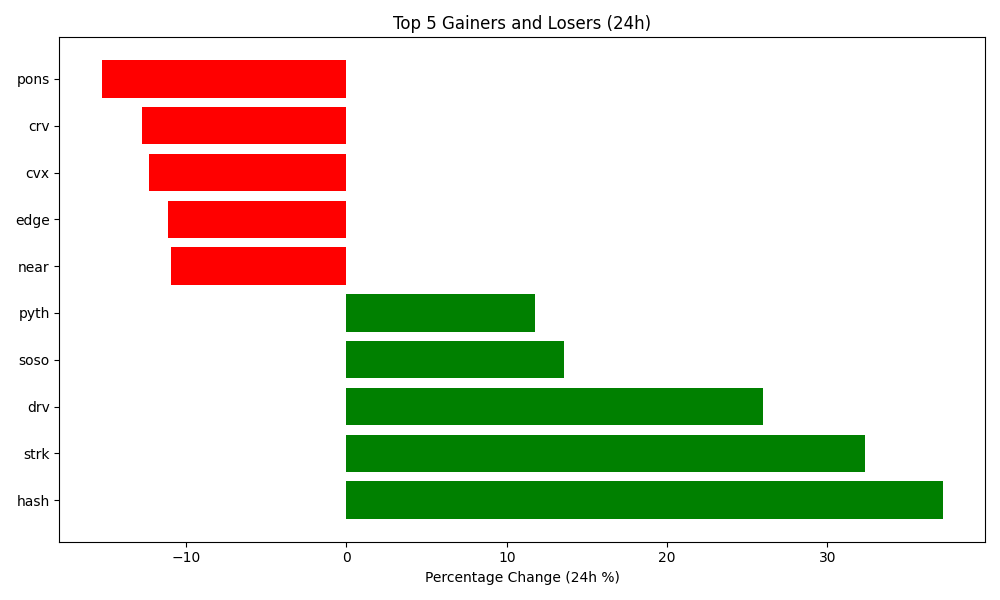

# Crypto Tracker (24h)
Author: Hitesh Agrawal

This repository automatically tracks the top 5 gaining, top 5 losing, and top 5 highest volume cryptocurrencies in the last 24 hours using the CoinGecko API, Python, Matplotlib, and GitHub Actions updates the below content everyday at midnight.

<!-- START_DYNAMIC_CONTENT -->
Last updated: 2026-10-08 03:51 UTC



**🚀 Top 5 Gainers (24h)**

| Rank | Coin | Price Change (24h %) | Volume (USD) | Current Price (USD) |
| :--: | :--: | :------------------: | :----------: | :-----------------: |
| 1 | grx | 62.09% | $2,218,523 | $21.1600 |
| 2 | met | 50.32% | $199,928,519 | $0.4773 |
| 3 | apepe | 20.31% | $8,387,702 | $0.0000 |
| 4 | prl | 16.66% | $6,443,838 | $1.3000 |
| 5 | jup | 12.68% | $141,061,816 | $0.3716 |


**👇 Top 5 Losers (24h)**

| Rank | Coin | Price Change (24h %) | Volume (USD) | Current Price (USD) |
| :--: | :--: | :------------------: | :----------: | :-----------------: |
| 1 | stonk | -16.10% | $20,811,218 | $0.1660 |
| 2 | br | -10.58% | $17,142,688 | $0.5073 |
| 3 | sky | -8.99% | $21,324,389 | $0.0795 |
| 4 | drv | -8.43% | $14,547,026 | $0.3641 |
| 5 | night | -7.52% | $19,635,788 | $0.0459 |


**💎 Top 5 by Trade Volume (24h)**

| Rank | Coin | Price Change (24h %) | Volume (USD) | Current Price (USD) |
| :--: | :--: | :------------------: | :----------: | :-----------------: |
| 1 | usdt | -0.04% | $70,263,772,939 | $0.9994 |
| 2 | btc | -1.61% | $35,904,476,885 | $82,818.0000 |
| 3 | usdc | -0.03% | $22,793,034,097 | $0.9996 |
| 4 | eth | -1.74% | $16,436,451,868 | $2,567.7300 |
| 5 | sol | -2.05% | $2,741,790,690 | $115.8500 |


<!-- END_DYNAMIC_CONTENT -->

## How to generate the coingecko demo public api key

[coingecko-api-key-docs](https://support.coingecko.com/hc/en-us/articles/21880397454233-User-Guide-How-to-sign-up-for-CoinGecko-Demo-API-and-generate-an-API-key)

## Requirements to setup
## 1. Install uv

```bash
brew install uv
✔︎ JSON API cask.jws.json                                                                                                                                                       [Downloaded   15.1MB/ 15.1MB]
✔︎ JSON API formula.jws.json                                                                                                                                                    [Downloaded   32.1MB/ 32.1MB]
# or Linux
curl -LsSf https://astral.sh/uv/install.sh | sh
```

---

## 2. Setup Python Environment (uv)

From the project root:

```bash
uv python install 3.12
uv venv --python 3.12
source .venv/bin/activate
```

Install dependencies (locked):
```bash
uv add pandas requests matplotlib python-dotenv
```


---

## 4. Update coingecko demo key in .env ( I have provided in .env.sample)
```bash
cat .env
CGK_API_DEMO_KEY="Your-coingecko-demo-api-key-here"
```

---

## 3. To manually run the script
```bash
python3.12 main.py
```
---
